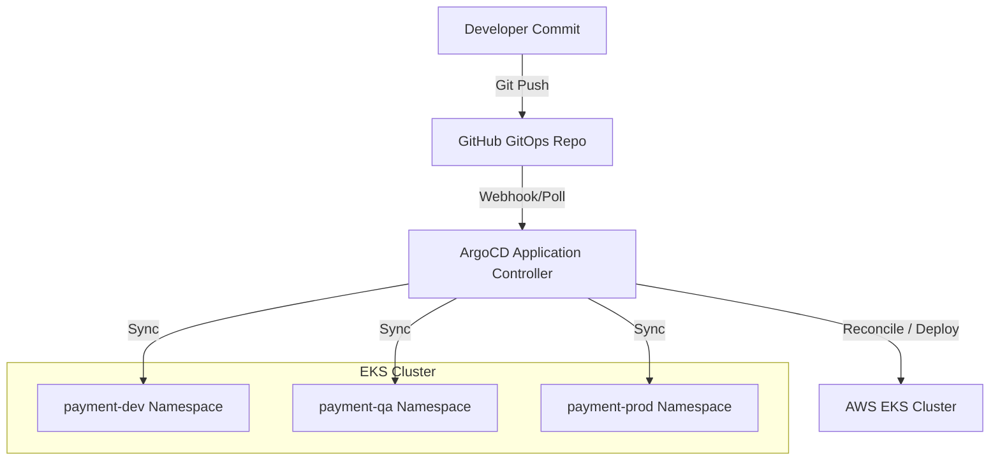

# Exercise 18 – GitOps Platform Using ArgoCD

This repository contains the complete, production-grade GitOps deployment manifests and execution documentation for managing application environments using ArgoCD and AWS EKS.

---

## 1. Architecture Diagram

Below is the design of the GitOps pipeline:



---

## 2. Folder Structure

The repository is structured as follows:

```text
.
├── argocd/
│   ├── dev-app.yaml        # ArgoCD App definition for Dev
│   ├── qa-app.yaml         # ArgoCD App definition for QA
│   └── prod-app.yaml       # ArgoCD App definition for Prod
├── gitops/
│   ├── dev/
│   │   └── payment-service/
│   │       ├── deployment.yaml
│   │       ├── ingress.yaml
│   │       ├── namespace.yaml
│   │       └── service.yaml
│   ├── qa/
│   │   └── payment-service/
│   │       ├── deployment.yaml
│   │       ├── ingress.yaml
│   │       ├── namespace.yaml
│   │       └── service.yaml
│   └── prod/
│       └── payment-service/
│           ├── deployment.yaml
│           ├── ingress.yaml
│           ├── namespace.yaml
│           └── service.yaml
├── docs/
│   ├── MANUAL-LAB-EXECUTION.md  # Detailed, first-person step-by-step logs
│   ├── RCA.md                   # Root Cause Analysis incident reports
│   └── HOW_I_SOLVED_IT.md       # Troubleshooting journal
└── README.md
```

---

## 3. ArgoCD Installation

To set up ArgoCD on your Kubernetes cluster, run the following:

```bash
# Create the namespace
kubectl create namespace argocd

# Install stable manifests
kubectl apply -n argocd -f https://raw.githubusercontent.com/argoproj/argo-cd/stable/manifests/install.yaml

# Verify deployment status
kubectl wait --namespace argocd \
  --for=condition=ready pod \
  --selector=app.kubernetes.io/name=argocd-server \
  --timeout=90s
```

---

## 4. GitOps Workflow

All changes in EKS are driven exclusively by commits to this repository.

1. **Modify Configs**: Update manifests (e.g. modify image tags or scale configuration) under `gitops/` directory.
2. **Push to GitHub**: Push changes to the main branch.
3. **Reconcile**: ArgoCD compares the desired state (Git) with the live state (EKS) and synchronizes automatically.

---

## 5. Demonstration Tasks

### Auto Sync Demo
Change the image version tag under `gitops/dev/payment-service/deployment.yaml`:
```yaml
image: nginx:v2
```
Push the commit. ArgoCD will immediately detect the difference and update the Pod container image without manual intervention.

### Self Heal Demo
Run the manual command to bypass Git and scale the production app:
```bash
kubectl scale deployment payment-service --replicas=10 -n payment-prod
```
ArgoCD detects the drift and automatically scales the deployment back to the desired 3 replicas specified in Git.

### Pruning Demo
Delete the `ingress.yaml` file from the `gitops/prod/payment-service/` directory and push. ArgoCD will clean up and delete the ingress resource from the cluster automatically.

---

## 6. Troubleshooting Guide & RCA

Refer to the following guides for detailed troubleshooting examples:
- Detailed execution commands: [MANUAL-LAB-EXECUTION.md](file:///e:/AIVAR/Devops/ex-18/docs/MANUAL-LAB-EXECUTION.md)
- Real troubleshooting scenarios: [HOW_I_SOLVED_IT.md](file:///e:/AIVAR/Devops/ex-18/docs/HOW_I_SOLVED_IT.md)
- Incident Root Cause Analysis: [RCA.md](file:///e:/AIVAR/Devops/ex-18/docs/RCA.md)
